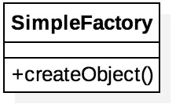

# Factory

[TOC]

## Introdução

Os padrões de projeto Factory (Simple Factory, Factory Method, Abstract Factory) encapsulam a criação de objetos. A proposta do padrão Factory é de criar objetos, por isso este é considerado um padrão criacional.

O cliente não precisa conhecer as diferentes implementações da interface ou da classe. A única coisa que o cliente precisa conhecer é a Factory (Factory Method ou Abstract Factory) para que possa obter uma instância de uma das implementações da interface. Dessa forma, os clientes são desacoplados da criação de objetos. Esse desacoplamento se dá em função da aplicação do princípio da **inversão de dependência**, ou seja, ao invés do cliente saber qual classe concreta ela precisa utilizar, ele delega isto para outra classe que retorna a implementação apropriada para aquela interface. Entre as vantagens do desacoplamento tem-se a possibilidade de serem implementadas classes concretas que podem ser alteradas sem afetar o cliente, reduzindo assim o acoplamento entre as classes e aumentando a flexibilidade.

## Padrão *Simple Factory*

O padrão *Simple Factory* gera uma instância de um objeto/serviço para o cliente sem expor nenhuma implementação ao cliente. Este padrão pode ser usado quando a criação de um objeto envolve alguma lógica de negócios além da inicialização. Isso ajuda a esconder essa lógica.

<div class='imagem' markdown='1' style="width: 20%">



</div>

```java
package _factory.exemplo_simple_factory;

public class Pizzaria {

    Pizza pizza;

    public static void main(String[] args) {

        Pizzaria pizzaria = new Pizzaria();

        /**
         * Gera uma instância do objeto sem expor nenhuma implementação. A fábrica toma a
         * decisão de qual subclasse deve ser retornada a instância baseado no argumento
         * passado.
         */
        pizzaria.pizza = PizzaFactory.criarPizza("portuguesa");
    }
}

final class PizzaFactory {

    private PizzaFactory() {}

    public static Pizza criarPizza(String tipo) {

        Pizza pizza = null;

        switch (tipo) {
            case "queijo":
                pizza = new PizzaQuatroQueijos();
                break;
            case "portuguesa":
                pizza = new PizzaPortuguesa();
                break;
            case "calabresa":
                pizza = new PizzaCalabresa();
                break;
            case "camarao":
                pizza = new PizzaCamarao();
                break;
        }
        return pizza;
    }
}

interface Pizza { }
class PizzaQuatroQueijos implements Pizza {}
class PizzaPortuguesa implements Pizza {}
class PizzaCalabresa implements Pizza {}
class PizzaCamarao implements Pizza {}
```

## Padrão *Factory Method*

O padrão *Factory Method* delega a implementação do código de criação para as suas subclasses. Portanto, *Factory Method* depende da herança, pois a criação do objeto é delegada às subclasses que implementam **o método *factory*** (em ingles, *Factory Method*) para criar objetos.

<div class='imagem' markdown='1' style="width: 50%">


</div>

```java
package _factory.exemplo_factory_method;

public class Pizzaria {

    Pizza pizza;

    public static void main(String[] args) {

        Pizzaria pizzaria = new Pizzaria();

        /**
         * É responsabilidade das subclasses instanciar o objeto. Ou seja, somente
         * PizzaFactorySaoPaulo e PizzaFactoryRioDeJaneiro sabem criar suas respectivas
         * pizzas.
         */
        PizzaFactory pizzariaSaoPaulo = new PizzaFactorySaoPaulo();
        pizzariaSaoPaulo.criarPizza("queijo");
        pizzaria.pizza = pizzariaSaoPaulo.delivery();
        // ou
        PizzaFactory pizzariaRioDeJaneiro = new PizzaFactoryRioDeJaneiro();
        pizzariaRioDeJaneiro.criarPizza("calabresa");
        pizzaria.pizza = pizzariaRioDeJaneiro.delivery();
    }
}

class PizzaFactorySaoPaulo extends PizzaFactory {

    @Override
    public void criarPizza(String tipo) {

        switch (tipo) {
            case "queijo":
                this.pizza = new SpPizzaQuatroQueijos();
                break;
            case "portuguesa":
                this.pizza = new SpPizzaPortuguesa();
                break;
            case "calabresa":
                this.pizza = new SpPizzaCalabresa();
                break;
        }
    }
}

class PizzaFactoryRioDeJaneiro extends PizzaFactory {

    @Override
    public void criarPizza(String tipo) {

        switch (tipo) {
            case "queijo":
                this.pizza = new RjPizzaQuatroQueijos();
                break;
            case "portuguesa":
                this.pizza = new RjPizzaPortuguesa();
                break;
            case "calabresa":
                this.pizza = new RjPizzaCalabresa();
                break;
        }
    }
}

abstract class PizzaFactory {

    protected Pizza pizza;

    /*
     * O método factory, que deve ser implementado pelas classes filhas.
     */
    public abstract void criarPizza(String tipo);

    public Pizza delivery() {
        return pizza;
    }
}

interface Pizza { }
class SpPizzaQuatroQueijos implements Pizza {}
class SpPizzaPortuguesa implements Pizza {}
class SpPizzaCalabresa implements Pizza {}
class RjPizzaQuatroQueijos implements Pizza {}
class RjPizzaPortuguesa implements Pizza {}
class RjPizzaCalabresa implements Pizza {}
```

## Abstract Factory

O padrão *Abstract Factory* fornece uma maneira de encapsular um grupo de fábricas individuais que têm um tema comum sem especificar suas classes concretas. *Abstract Factory* possui em sua composição a implementação de vários *Factory Method*.

<div class='imagem' markdown='1' style="width: 50%">


</div>

Caso a pizzaria, do exemplo anterior, tivesse um padrão na construção de pizzas, algo comum a todos os estados, mudando apenas a intensidade dos ingredientes, por exemplo: São Paulo tende a ter a massa mais grossa do que no Rio de Janeiro. Caso esse seja o cenário, o *Abstract Factory* seria a solução ideal.

As pizzas `PizzaQuatroQueijos`, `PizzaCalabresa` e `PizzaPortuguesa` possui o campo `ingredientes` que é do tipo da **interface abstrata de Factory** (em ingles, *Abstract Factory*). As pizzas (cliente) não tem conhecimento algum do tipo concreto do Factory.

```java
package exemplo_abstract_factory;

public class Pizzaria {

    Pizza pizza;

    public void criarPizza(String cidade, String tipo){

        switch (tipo) {
            case "queijo":
                this.pizza = new PizzaQuatroQueijos(getIngredientes(cidade));
                break;
            case "portuguesa":
                this.pizza = new PizzaPortuguesa(getIngredientes(cidade));
                break;
            case "calabresa":
                this.pizza = new PizzaCalabresa(getIngredientes(cidade));
                break;
        }
    }

    private PizzaIngredientesFactory getIngredientes(String cidade) {

        if (cidade.equals("sao-paulo")) {
            return new SPPizzaIngredientesFactory();
        }
        return new RJPizzaIngredientesFactory();
    }

    public static void main(String[] args) {

        Pizzaria pizzaria = new Pizzaria();
        pizzaria.criarPizza("queijo", "sao-paulo");
    }
}

abstract class PizzaIngredientesFactory {

    public abstract Massa criarMassa();
    public abstract Queijo criarQueijo();
}

class SPPizzaIngredientesFactory extends PizzaIngredientesFactory {

    @Override
    public Massa criarMassa() {
        return new MassaGrossa();
    }

    @Override
    public Queijo criarQueijo() {
        return new QueijoMinas();
    }
}

class RJPizzaIngredientesFactory extends PizzaIngredientesFactory {

    @Override
    public Massa criarMassa() {
        return new MassaFina();
    }

    @Override
    public Queijo criarQueijo() {
        return new QueijoParmesao();
    }
}

// class PizzaCalabresa extends Pizza
// class PizzaPortuguesa extends Pizza
class PizzaQuatroQueijos extends Pizza {

    private PizzaIngredientesFactory ingredientes; // tipo abstrato
    private Massa massa;
    private Queijo queijo;

    public PizzaQuatroQueijos(PizzaIngredientesFactory ingredientes){
        this.ingredientes = ingredientes;
    }

    public void prepara(){
        massa = ingredientes.criarMassa();
        queijo = ingredientes.criarQueijo();
    }
}

class Pizza {}
class Massa {}
class MassaFina extends Massa {}
class MassaGrossa extends Massa {}
class Queijo {}
class QueijoMinas extends Queijo {}
class QueijoParmesao extends Queijo {}
```
