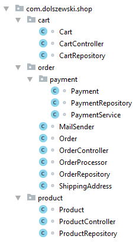

# Estrutura de projetos

[TOC]

## Camadas

### Controller

A camada de controle (em inglês, controller) gerencia e orquestra o trabalho, mas não faz o trabalho. Em outras palavras, faz alguma verificação/validação para descobrir para quais serviços os dados da requisição HTTP devem ser enviados e orquestra essas chamadas de serviço.

Atribuições:

- Gerencia as requisições HTTP recebidas
- Decide qual serviço deve fazer o trabalho
- Divide o trabalho em unidades consideráveis
- Passa os dados necessários das requisições HTTP para o(s) serviço(s)
- Se o trabalho exigir vários serviços trabalhando em várias coisas, orquestra as chamadas dos serviços.
- O controlador não deve estar fazendo o trabalho.

### Model

A camada de modelo (em inglês, model) representa o domínio do problema, mantém o estado e fornecer métodos para acessar e alterar o estado da aplicação.

### Service

A camada de serviço (em inglês, service) é responsável por concluir o trabalho e devolvê-lo ao *controller*. Ele contém a lógica de negócio necessária para realmente atender aos requisitos e retornar o que o consumidor da API está solicitando.

Atribuições:

- Recebe os dados de que precisa do gerente para executar suas tarefas
- Descobre os algoritmos, lógica de negócios, chamadas ao banco de dados, etc envolvidos na conclusão da solicitação.
- Geralmente se preocupa apenas com as tarefas que ele deve concluir
- Não é responsável por orquestrar as diferentes chamadas de serviço
- Realiza o trabalho real necessário para concluir as tarefas/solicitação
- Retorna uma resposta para o *controller*

A camada de serviço (em inglês, service) é um padrão interessante para aplicações que possuem regras de negócio/fluxos de funcionamento complexos e, além disso, para aplicações que possuem diferentes interfaces para um mesmo conjunto de dados (aplicações web, web services, desktop, etc). Ao usar esse padrão passamos a ter um ponto bem claro na arquitetura em que vamos codificar regras de negócio complexas, como aquelas que envolvem várias entidades e ações distintas.

Por exemplo, imagine um sistema de gerenciamento escolar que conta com a funcionalidade de "trancamento de curso". Ao trancar o curso algumas regras devem ser aplicadas:

- O status do aluno deve ser alterado para INATIVO;
- Todas as disciplinas em que o aluno está matriculado devem ser também trancadas;
- O coordenador deve ser notificado do trancamento via e-mail.

Perceba que são regras que envolvem várias entidades (diferente de um simples CRUD) e ações específicas (enviar e-mail). Se tivéssemos uma aplicação MVC apenas, a parte de acesso a dados já estaria no model, mas as regras de negócio talvez acabassem sendo implementadas no *controller*. Posteriormente, quando precisássemos criar um web servisse para permitir que essa funcionalidade seja acessada via app mobile, a lógica seria repetida e aí já teríamos um problema de duplicação de código. Como essa funcionalidade é comum para as diversas "interfaces" do sistema, podemos codifica-la na camada de serviço, que passaria a ser consumida pelas camadas superiores (camada de apresentação - web, serviços).

### Repository

O *Repository* é considerado um padrão de domínio e faz parte das regras de negócios de uma aplicação. É uma interface que não sabe nada da infra-estrutura. Ele não conhece o banco de dados. O que ele conhece é o domínio da aplicação. O *Repository* acessa o DAO que por sua vez devolve os dados de uma consulta. Portanto, *Repository* se torna apenas um "repositório de domínio".

O padrão *Repository* tem o objetivo de dar apoio ao domínio (modelo) fornecendo persistência ou não. Ao contrário do DAO, que é um objeto de infra-estrutura da aplicação e faz parte da camada de persistência. O *Repository* faz parte do modelo de domínio que é parte da camada de negócios. O *Repository* inclusive não precisa apenas ser usado em acesso a dados que venham de uma base de dados, podem servir para outros tipos de operações.

### View

A camada de visualização (em inglês, view) converte dados em uma renderização visual para resposta ao cliente (por exemplo, navegador da Web ou outro consumidor). Os dados serão fornecidos principalmente pelo *controller*; no entanto, a *view* também pode ter um auxiliar que pode recuperar dados associados à renderização e não necessariamente à solicitação atual (por exemplo, dados *aside*, dados de rodapé).

Atribuições:

- É a camada que exibe uma representação dos dados.
- É camada de interface com usuário (*client-side*).
- Faz a exibição dos dados, utilizando-se de HTML, XML, etc.

### Value Objects

As entidades têm identidades (ID), os *value objects* não. Se as identidades de duas entidades forem diferentes, elas serão consideradas objetos/entidades diferentes, mesmo que todas as propriedades dessas entidades sejam iguais. Imagine duas pessoas diferentes que têm o mesmo nome, sobrenome e idade, mas são pessoas diferentes (seus números de identidade são diferentes). Para uma classe Endereço (que é um *value object* clássico), se os dois endereços tiverem o mesmo país, cidade e número da rua, etc., eles serão considerados o mesmo endereço.

No *DDD - Domain Driven Design* (Design Orientado a Domínio), o *value object* é outro tipo de objeto de domínio que pode incluir lógica de negócios e é uma parte essencial do domínio.

## Organização de pacotes

Da perspectiva da linguagem, os pacotes em Java fornecem dois *features* importantes, que são utilizados pelo compilador.

- Definição de namespace para classes. Várias classes com o mesmo nome podem ser usadas em um único projeto, desde que pertençam a pacotes diferentes que distinguem uma classe da outra.

- Permitir definir modificadores de acesso para membros específicos de um projeto. A acessibilidade de uma classe, interface, campos ou métodos, pode ser limitada ou completamente proibida para membros de pacotes diferentes.

### Organização por camadas

Organiza a estrutura de classes por camadas.

#### Prós

- Encontrar o lugar certo para uma nova classe em um aplicativo como esse é realmente uma operação fácil. A estrutura é criada no início do desenvolvimento e mantida inalterada durante toda a existência do projeto. A simplicidade permite manter o projeto em ordem, mesmo por desenvolvedores menos experientes, pois a estrutura é facilmente compreensível.

#### Contras

- Uma grande desvantagem da abordagem do pacote por camada é o uso excessivo do modificador de acesso público. A exposição de um repositório apenas a uma única classe de serviço requer que o repositório seja público. Como efeito colateral, o repositório é acessível a todas as outras classes do projeto, mesmo a partir de camadas que não devem se comunicar diretamente com ele. Essa abordagem incentiva a criação de código espaguete não sustentável e resulta em alto acoplamento entre pacotes.

- Mais difícil avaliar a complexidade de um *feature* apenas observando o código à medida que as classes se espalham por vários diretórios.

- O nome de um pacote deveria fornecer detalhes adicionais sobre seu conteúdo. Na abordagem pacote por camada, todos os pacotes descrevem a arquitetura da solução, mas, separadamente, eles não fornecem informações úteis. Na verdade, em muitos casos, eles duplicam as informações presentes nos nomes das classes de seus membros.

### Organização por *features*

Organiza a estrutura de classes em torno de *features* (funcionalidades) ou modelos de domínio.

#### Prós

- Quando todas as classes de *features* estão em um único pacote, o modificador de acesso público é muito mais expressivo, pois permite descrever qual parte de um *feature* deve ser acessível por outras partes da aplicação. Dentro de um pacote, você deve favorecer o uso do modificador privado do pacote para melhorar a modularização. Tornar algo público deve ser uma decisão consciente. Menos conexões entre classes de pacotes diferentes levarão a uma base de código mais limpa e mais sustentável.

- Os pacotes têm nomes muito mais significativos que descrevem sua finalidade funcional. Apenas olhando a estrutura do projeto, você provavelmente pode adivinhar o que os usuários podem fazer com a aplicação. A abordagem também expressa conexões hierárquicas entre *features*. As raízes agregadas do domínio podem ser facilmente identificadas, pois existem no nível mais baixo da árvore de pacotes. A estrutura do pacote documenta o aplicativo.

- Com a crescente popularidade da arquitetura de microsserviço, é muito mais fácil converter em um serviço monolítico que já é cortado por *features*, muito mais fácil de converter em serviços separados do que em um projeto que organiza classes por camadas. A adoção do pacote por abordagem de *features* prepara seu aplicativo para um crescimento escalável.

#### Contras

- Juntamente com o desenvolvimento do projeto, a estrutura dos pacotes requer mais cuidado. É importante entender que a árvore de pacotes evolui com o tempo à medida que o aplicativo se torna mais complexo. De tempos em tempos, você terá que parar um pouco e considerar mover um pacote para um nó diferente ou dividi-lo em outros menores. A clareza da estrutura não é de graça. A equipe é responsável por manter uma boa forma com o alinhamento ao conhecimento sobre o domínio.

- Compreender o domínio é o elemento chave da estrutura limpa do projeto. A escolha do local certo para um novo *feature* pode ser problemática, especialmente para os recém-chegados da equipe, pois requer conhecimento sobre os negócios por trás do seu aplicativo. Algumas pessoas podem considerar isso uma vantagem, pois a abordagem incentiva o compartilhamento de conhecimento entre os membros da equipe. A introdução de um novo desenvolvedor no projeto consome um pouco mais de tempo, mas pode ser vista como um investimento.
