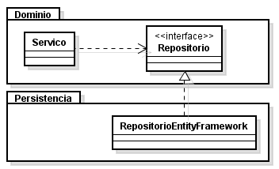

# Inversão de Dependência

[TOC]

## Introdução

O Princípio da Inversão de Dependência (Dependency Inversion Principle), ou simplesmente DIP é base para um bom design orientado a objetos e extremamente importante para o projeto de uma arquitetura de software flexível e focada no domínio.

O DIP diz que:

- Módulos de alto nível não devem depender de módulos de baixo nível. Ambos devem depender de abstrações;
- Abstrações não devem depender de detalhes. Detalhes devem depender de abstrações.

Inverter a dependência faz com que um cliente não fique frágil a mudanças relacionadas a detalhes de implementação. Isto é, alterar o detalhe não quebra o cliente. Além disso, o mesmo cliente pode ser reutilizado com outro detalhe de implementação.

### Exemplo de violação

Vejam o exemplo do botão e da lâmpada, onde ambas as classes `Botao` e `Lampada` são classes concretas:

```java
public class Botao {

    private Lampada _lampada;

    public void Acionar() {
        if (condicao)
            _lampada.Ligar();
    }
}
```

O design acima viola o DIP uma vez que `Botao` depende de uma classe concreta `Lampada`. Ou seja, `Botao` conhece detalhes de implementação ao invés de termos identificado uma abstração para o design.

Que abstração seria essa? `Botao` deve ser capaz de tratar alguma ação e ligar ou desligar algum dispositivo, seja ele qual for: uma lâmpada, um motor, um alarme, etc.

### Invertendo a dependência

A solução abaixo inverte a dependência de botão para a lâmpada, fazendo com que ambos agora dependam da abstração Dispositivo:

```java
public class Botao {

    private Dispositivo _dispositivo;

    public void Acionar(){

        if (condicao)
            _dispositivo.Ligar();
    }
}

public interface Dispositivo {
    void Ligar();
    void Desligar();
}

public class Lampada : Dispositivo {

    public void Ligar() {
        // ligar lampada
    }

    public void Desligar() {
        // desligar lampada
    }
}
```

Ilustrando com UML, o que antes era:

<div class='imagem' markdown='1' style="width: 70%">


</div>

Passa a ser:

<div class='imagem' markdown='1' style="width: 70%">


</div>

O Princípio da Inversão de Dependência é um dos pilares para uma boa arquitetura de software, focada na resolução do problema e flexível quanto a detalhes de implementação, como bancos de dados, serviços web, leitura/escrita de arquivos, etc.

Este princípio reforça que a abstração está mais relacionada ao seu cliente do que ao servidor (a classe que realiza a abstração). No exemplo ilustrado acima, `Dispositivo` (a abstração) está diretamente ligado ao cliente (`Botao`). Sua implementação (`Lampada`) é um mero detalhe.

Sendo assim, `Dispositivo` ficaria no mesmo pacote (ou componente) do `Botao` e não junto com sua implementação `Lampada`. (Esta separação de interface e implementação em componentes distintos é um padrão conhecido por *Separated Interface*.)

Outro exemplo bem comum deste padrão está no uso do padrão Repositório. Neste caso, aplicamos o DIP para que nosso domínio dependa de uma abstração do Repositório, ficando totalmente isolado de detalhes sobre persistência:

<div class='imagem' markdown='1' style="width: 70%">



</div>

Levando a interface para junto do cliente, estamos dizendo "o cliente funciona dessa maneira" e quem implementa a interface (em outro componente) é que deve atender a essa exigência. Ou seja, a interface só mudará por necessidade **do cliente**.

Por fim, quando há vários clientes em componentes distintos para a mesma interface, esta fica em um componente a parte. Voltando ao exemplo do Botão, ao colocar `Dispositivo` em um componente próprio (nem com o cliente nem com o servidor), ele poderia ser utilizado por `Botao` e por qualquer outro objeto capaz de ligar/desligar um dispositivo:

<div class='imagem' markdown='1' style="width: 80%">


</div>

## Conclusão

O Princípio da Inversão de Dependência é um princípio essencial para um bom design orientado a objetos, ao passo que o oposto leva a um design engessado e procedural.

Identificar abstrações e inverter as dependências garantem que o software seja mais flexível e robusto, estando melhor preparado para mudanças.

Encerramos assim a série sobre os princípios SOLID, que juntos formam um conjunto de boas práticas que devemos ter em nosso cinto de utilidades e que devemos aplicar sempre que pudermos para melhorar a qualidade do design e da arquitetura do software.
