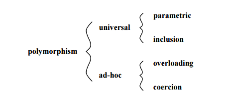

# Polimorfismo

[TOC]

## Introdução

Polimorfismo é a capacidade de um objeto poder ser referenciado de várias formas.

<div class='importante' markdown='1'>

Polimorfismo não quer dizer que o objeto fica se transformando, muito pelo contrário, um objeto nasce de um tipo e morre daquele tipo, o que pode mudar é a maneira como nos referimos a ele.

</div>

Os principais tipos de polimorfismo podem ser classificados da seguinte forma:

<div class='imagem' markdown='1'>



</div>

## Polimorfismo por inclusão

Também conhecido em inglês como *subtype polymorphism* ou *inclusion polymorphism*. Esse é o polimorfismo que pode ser considerado entre os mais conhecidos, pois é o que muitos costumam dizer quando falam de 'polimorfismo'. São subclasses que fornecem diferentes implementações de algum método da super classe. Neste caso o método chamado será baseado na instância que o chamar.

```java
package exemplo_polimorfismo_inclusao;

abstract class Operacao {

    abstract double calcular(double x, double y);
}

class Soma extends Operacao {

    double calcular(double x, double y) { return x + y; }

    void apresentar() { System.out.println("Função soma"); }
}

class Subtracao extends Operacao {

    double calcular(double x, double y) { return x - y; }

    void apresentar() { System.out.println("Função subtração"); }
}

public class Exemplo {

    /*
     * O Objeto do tipo Operacao, poderá ser tanto de Soma quanto de Subtracao
     */

    public static void mostrarCalculo(Operacao operacao, double x, double y) {

        System.out.println("O resultado é: " + operacao.calcular(x, y));

        /*
         * Somente métodos presentes em Operacao poderão ser chamados
         */
        // operacao.apresentar(); // ERRO!
    }

    public static void main(String[] args) {

        Exemplo.mostrarCalculo(new Soma(), 5, 5);      // 10
        Exemplo.mostrarCalculo(new Subtracao(), 5, 5); // 0
    }
}

// Saida
// > O resultado é: 10.0
// > O resultado é: 0.0
```

## Polimorfismo paramétrico

Também conhecido em inglês como `Parametric polymorphism`. Também é chamado de `Generics` em Java e C#, e templates em C++. Diferente do polimorfismo por sobrecarga, basicamente é uma função (ou método) ou um tipo de dado que pode ser escrito genericamente para que ele possa lidar com valores de forma idêntica sem depender do seu tipo.

```java
package exemplo_polimorfismo_parametrico;

public class Exemplo  {

    /*
     * Método genérico
     */
    public static <E> void printArray( E[] inputArray )  {

        for (E element : inputArray) {

            System.out.printf("%s ", element);
        }
    }

    public static void main( String args[] )  {

        Integer[] intArray = {1, 2, 3, 4, 5};
        Double[] doubleArray = {1.1, 2.2, 3.3, 4.4 };
        Character[] charArray = {'H', 'E', 'L', 'L', 'O'};

        System.out.print( "Array integer: " );
        printArray( intArray  );

        System.out.print( "\nArray double: " );
        printArray( doubleArray );

        System.out.print( "\nArray character: " );
        printArray( charArray );
    }
}

// Saida
// > Array integer: 1 2 3 4 5
// > Array double: 1.1 2.2 3.3 4.4
// > Array character: H E L L O
```

## Polimorfismo por sobrecarga

Também conhecido em inglês como ` Overloading Ad-hoc Polymorphism`. Neste caso a escolha de qual método será chamado será baseado na quantidade ou nos tipos de parâmetros da função.

```java
package exemplo_polimorfismo_sobrecarga;

class Polimorfismo {

    void metodo(int parA, int parB) {
        System.out.println("int, int");
    }
}

class Exemplo extends Polimorfismo {


    void metodo(String parA, String parB) {
        System.out.println("String, String");
    }

    void metodo(String parA, int parB) {
        System.out.println("String, int");
    }

    void metodo(String parA) {
        System.out.println("String");
    }

    public static void main(String[] args) {

        Exemplo t = new Exemplo();
        t.metodo("teste", "teste");
        t.metodo("teste", 10);
        t.metodo("teste");

        /*
         * Chamando o método da superclasse
         */
        t.metodo(10, 10);
    }
}

// Saida
// > String, String
// > String, int
// > String
// > int, int
```

## Polimorfismo por coerção

Também conhecido em inglês como ` Coercion Ad-hoc Polymorphism`. Acontece quando um tipo primitivo ou um objeto é 'convertido' em outro tipo de objeto ou tipo primitivo, e essas conversões podem ser implícitas (feitas automaticamente) ou explicitada.

```java
package exemplo_polimorfismo_coercao;

class Polimorfismo {

    void metodo() {
        System.out.println("pai");
    }
}

class Exemplo extends Polimorfismo {

    String campo;

    Exemplo(String campo) {

        this.campo = campo;
    }

    void metodo() {
        System.out.println("filho");
    }

    void apresentar() {
        System.out.println("olá");
    }

    public static void main(String[] args) {

        /*
         * Coerção implícita
         */

        /*
         * O objeto p é uma instância de Exemplo mas somente com os
         * métodos e campos presente em Polimorfismo. Portanto não há como
         * chamar o método apresentar de Exemplo.
         */
        Polimorfismo p = new Exemplo("campo");
        p.metodo();
        // p.apresentar(); // ERRO!
        // p.campo; // ERRO!

        /*
         * Coerção explícita
         */

        /*
         * Após a coerção do objeto p novamente para uma instâmcia de
         * Exemplo, o campo pode ser acessado novamente. O valor dos
         * campos não foi perdido nesse processo.
         */
        Exemplo t = (Exemplo) p;
        System.out.println(t.campo);

        /*
         * Tipos primitivos e Strings
         */
        int i = (int) 10.2;
        String s = Double.toString(10.2); // ou String.valueOf(10.2);
    }
}

// Saida:
// > filho
// > campo
```
